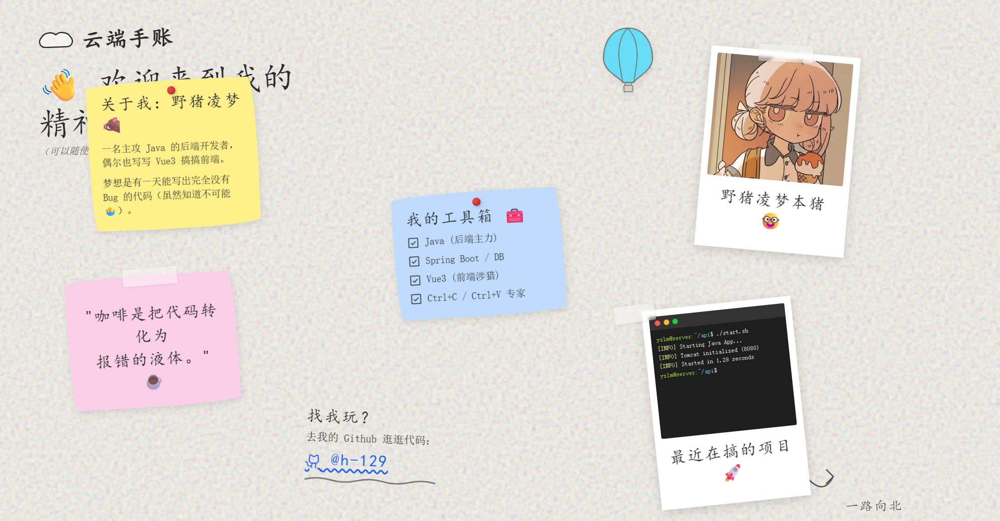

# 野猪凌梦的灵感手账本 🐗 (Personal Scrapbook Portfolio)

欢迎来到我的“精神角落”！这是一个充满创意与互动性的个人主页。与传统千篇一律的官方模板不同，这个项目采用了独特的手工“手账（Scrapbook）”设计风格，所有的卡片、照片和便利贴都仿佛散落在书桌上，并且**允许访客自由拖拽互动**。



## ✨ 项目特色 (Features)

- 🎨 **手账质感美学**：使用复古纸张纹理背景、不规则裁剪的便利贴、被胶带贴在墙上的拍立得照片，打造浓厚的手工质感。
- 🖱️ **高自由度交互**：页面上的所有主要元素（便利贴、拍立得、涂鸦卡片）都可以被鼠标或触屏随意拖拽和重新排列。
- ☁️ **生动的动态效果**：背景有缓缓升空的 CSS 动画热气球，底部备案标签设计成逼真的破损纸胶带。
- 💻 **极客彩蛋**：专属的 macOS 风格 Linux 迷你终端界面，专为展示后端开发者的硬核属性而设计。
- ⚡ **极致加载速度（全本地化）**：去除了所有可能受网络环境限制的外部 CDN 依赖。Google Fonts 和 Phosphor 图标库均已实现 **100% 本地化加载**。
- 📱 **多端适配**：支持桌面端与移动端的流畅访问，无论大小屏幕均能完美体验拖拽乐趣。

## 🛠️ 技能栈 (Tech Stack)

本项目保持了最轻量级的设计，不依赖庞大复杂的前端框架，极大降低了部署与二开的门槛：
- **HTML5 & CSS3**：原生实现页面布局、绝大多数动画效果与手账质感。
- **Vanilla JavaScript**：原生 JS 驱动丝滑的物理拖拽逻辑（支持多指触控与鼠标事件）。
- **Vite**：仅作为本地轻量级开发服务器，提供极速的 HMR（热更新）和局域网多设备调试支持。

## 🚀 快速开始 (Getting Started)

由于项目本质是原生的 Web 三件套，因此运行极其简单。

### 本地开发与预览
确保您的电脑上已安装了 [Node.js](https://nodejs.org/)。

```bash
# 1. 安装依赖 (主要是 Vite 等开发工具)
npm install

# 2. 启动本地开发服务器
npm run dev
```
启动后，控制台会输出访问地址。由于配置了 `--host`，您可以通过局域网 IP 在手机上直接预览效果。

### 部署上线 (Deployment)

由于项目完全本地化且无复杂的框架编译依赖，您只需将以下文件/文件夹直接上传到任意静态 Web 服务器（如 Nginx, Github Pages, Vercel 等）即可运行：
- `index.html`
- `css/` 文件夹
- `js/` 文件夹
- `images/` 文件夹
- `fonts/` 文件夹

*(注：`node_modules` 和 `package.json` 仅用于本地开发，无需上传到服务器！)*

## 👨‍💻 关于作者 (About the Author)

**野猪凌梦** 
一名主攻 Java 的后端开发者，偶尔也写写 Vue3 搞搞前端。
梦想是有一天能写出完全没有 Bug 的代码（虽然知道不可能 🤷‍♂️）。

- **GitHub**: [https://github.com/h-129](https://github.com/h-129)

## 📄 开源协议 (License)

本项目采用 [MIT License](LICENSE) 协议进行开源。欢迎自由 Fork、修改和使用！
